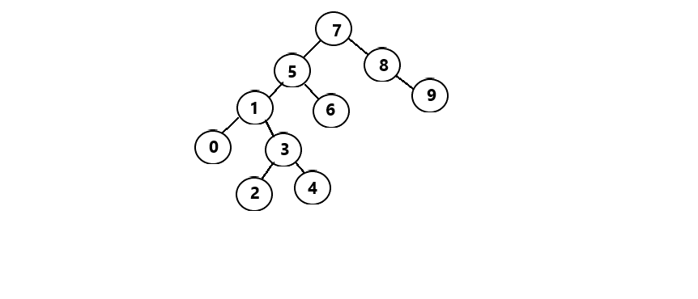

# Binary Search Tree
## Patika.dev Profilim = [https://app.patika.dev/krgzsalih](https://app.patika.dev/krgzsalih)

[7, 5, 1, 8, 3, 6, 0, 9, 4, 2] dizisinin Binary-Search-Tree aşamaları aşağıdaki şekildedir.

- Root sayımızı ilk eleman olduğu için '7' kabul ediyoruz en başa, merkeze yazıyoruz.
- Sonra sırasıyla dizinin elemanlarına devam ederek büyük ise sağına, küçük ise soluna yazıyoruz.
- Örneğin; 5 sayısı 7 sayısından küçük olduğu için soluna yazılıyor. Sonra 1 sayısı geliyor ve o ikisinden de küçük olduğu için 5'in soluna yazılıyor.
- Daha iyi anlaşılabilmesi için, 3 sayısını ele alalım. 3 sayısı, 7 sayısından küçük olduğu için soluna geçiyor ve 5'e geliyor. 5 sayısından da küçük olduğu için tekrar sol tarafa geçiyor ve geliyor 1 sayısına. 3 sayısı 1 sayısından büyük olduğu için bu sefer sağ tarafa yerleşiyor ve dizinin geri kalan elemanları da sıralamaya yerleştirilene kadar bu işlem devam ediyor.

